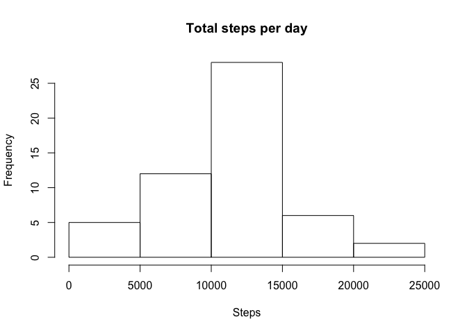
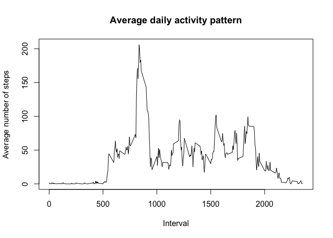
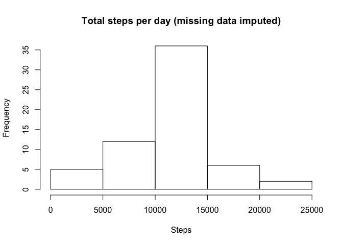

# Reproducible Research: Peer Assessment 1


## Loading and preprocessing the data


```r
## load the plyr library which we'll use to impute missing data
library(plyr)

## load the plyr library which we'll use to make the weekday plots
library(lattice) 

## unzip the data and get the files
files <- unzip("activity.zip")
activity <- read.csv(files)
```


## What is mean total number of steps taken per day?

```r
## Excluding NA values, get the aggregate sum of steps per day
totalStepsPerDay <- aggregate(activity$steps[!is.na(activity$steps) & !is.na(activity$date)], list(day=activity$date[!is.na(activity$steps) & !is.na(activity$date)]),sum)

## Give the new dataframe meaningful column names
names <- colnames(totalStepsPerDay)
names[2] <- "total_steps"
colnames(totalStepsPerDay) <- names

## retrieve the mean and median for the steps and store them in variables
meanOnTotal <- as.integer(mean(totalStepsPerDay$total_steps))
medianOnTotal <- median(totalStepsPerDay$total_steps)

## draw a histogram of the total steps
hist(totalStepsPerDay$total_steps, main="Total steps per day", xlab="Steps")
```

 

The median total number of steps is 10765. The mean is 10766 to the nearest integer.

## What is the average daily activity pattern?

```r
## Excluding NA values, get the aggregate sum of steps per day
averageStepsPerDay <- aggregate(activity$steps[!is.na(activity$steps) & !is.na(activity$date)], list(interval=activity$interval[!is.na(activity$steps) & !is.na(activity$date)]),mean)

## Give the new dataframe meaningful column names
names <- colnames(averageStepsPerDay)
names[2] <- "average_steps"
colnames(averageStepsPerDay) <- names

## Plot as a line chart
plot(averageStepsPerDay$interval, averageStepsPerDay$average_steps, type="l", main="Average daily activity pattern", xlab="Interval", ylab="Average number of steps")
```

 

```r
## Get the 5-minute interval that, on average across all the days in the dataset, contains the maximum number of steps
maxInterval <- averageStepsPerDay$interval[averageStepsPerDay$average_steps == max(averageStepsPerDay$average_steps)]
```

835 is the 5-minute interval that, on average across all the days in the dataset, contains the maximum number of steps.

## Imputing missing values


```r
## get all rows with missing data
missingData <- activity[is.na(activity),]
numberOfMissingRows <- length(missingData$steps)
```

There are 2304 rows with missing data.

In order to determine the best way to fill in the missing data, I poked around StackOverflow and found a thread on [imputing missing data with a mean](http://stackoverflow.com/questions/9322773/how-to-replace-na-with-mean-by-subset-in-r-impute-with-plyr). Modified the code for this particular data set, but the original concept can be found at that link. 


```r
## Will replace the missing data fields with the mean of the steps for that interval using the plyr library

## create a function to impute the missing data of variable x with the mean of the group
impute.mean <- function(x) replace(x, is.na(x), mean(x, na.rm = TRUE))

## using plyr, set the group to interval and pass the steps column as an argument to the impute mean function (above).
activitesWithoutMissingData <- ddply(activity, ~ interval, transform, steps = impute.mean(steps))

## Because plyr will order the new dataset by group (interval), we'll manually set it back to be ordered by date so it'll match the original set.
activitesWithoutMissingData <- activitesWithoutMissingData[order(activitesWithoutMissingData$date), ]

## Use essentially the same code from the first section, but with the imputed data

## Get the aggregate sum of steps per day
totalStepsPerDay_NoMissingData <- aggregate(activitesWithoutMissingData$steps, list(day=activitesWithoutMissingData$date),sum)

## Give the new dataframe meaningful column names
names <- colnames(totalStepsPerDay_NoMissingData)
names[2] <- "total_steps"
colnames(totalStepsPerDay_NoMissingData) <- names

## retrieve the mean and median for the steps and store them in variables
meanOnTotal_noMissing <- as.integer(mean(totalStepsPerDay_NoMissingData$total_steps))
medianOnTotal_noMissing <- as.integer(median(totalStepsPerDay_NoMissingData$total_steps))

## draw a histogram of the total steps
hist(totalStepsPerDay_NoMissingData$total_steps, main="Total steps per day (missing data imputed)", xlab="Steps")
```

 

The median total number of steps is 10766 to the closest integer. The mean is also 10766 to the closest integer. While before, the median was one-off, it is now the same as the mean.


## Are there differences in activity patterns between weekdays and weekends?


```r
## create new column that says the weekday for each date
activitesWithoutMissingData$day <- weekdays(as.Date(activitesWithoutMissingData$date)) 

## create vector of weekdays
weekdays <- c("Monday","Tuesday","Wednesday","Thursday","Friday")

## replace any weekday with the string "weekday"
activitesWithoutMissingData$day[activitesWithoutMissingData$day %in% weekdays] <- "weekday"

## replace all others (Saturday & Sunday) with the string "weekend"
activitesWithoutMissingData$day[activitesWithoutMissingData$day != "weekday"] <- "weekend"

## aggregate the weekends and weekdays
stepsByWeekday <- aggregate(activitesWithoutMissingData$steps, list(day = activitesWithoutMissingData$day, interval = activitesWithoutMissingData$interval), mean)

## give meaningful column names
names <- colnames(stepsByWeekday)
names[3] <- "steps"
colnames(stepsByWeekday) <- names

xyplot(steps~interval|day, stepsByWeekday, layout = c(1,2), type = "l")
```

 

There is certinaly a difference in activity level for weekends and weekdays. 

At first glance, it appears that weekends have a slower start (presumably as people sleep in), there is a slightly more uniform look to the days activites, with regular spikes and valleys (likely as people run errands, come home to relax, etc.)

It looks like weekdays on the other hand, spike earlier in the day, probably as people are commuting in. Once they start working, there is a sharp dropoff and the rest of the day shows the same peaks and valleys of the weekend, but on a much lower range. 

These are all very high level assumptions however, and more analysis would be needed to try and confirm these thoughts. 
